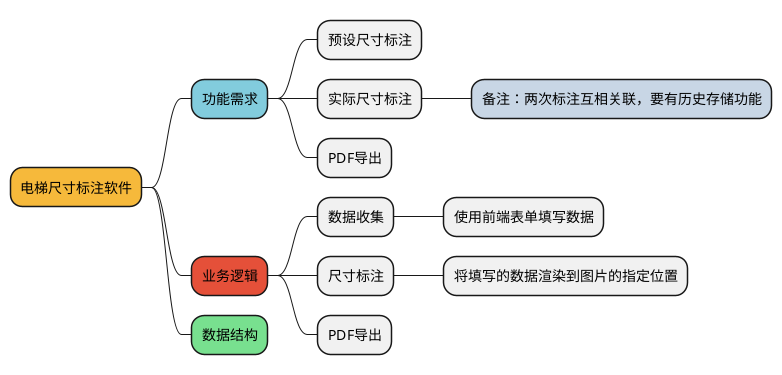

# 电梯尺寸标注软件

## 功能需求

### 预设尺寸标注

- 整体

  - 电梯行程

- 底坑

  - 底坑高度
  - 底坑宽度
  - 底坑深度

- 楼层

  - 门洞高度
  - 门洞宽度
  - 踢脚高度

- 顶板
  - 顶板下空间高度
  - 顶板下空间宽度
  - 顶板下空间深度
- BI
  - 预留宽度
  - 预留高度
  - 预留深度

## 业务逻辑

## 项目需求
