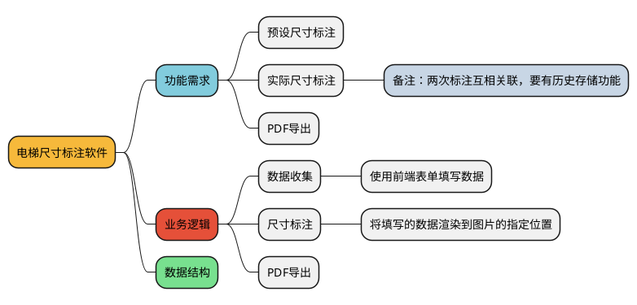

# 电梯尺寸标注软件



## 功能需求

实现电梯尺寸标注软件的功能需求如下：

1. 预设尺寸标注：软件可以标注预估尺寸
2. 实际尺寸标注：软件可以让用户在图片中标注实际的电梯尺寸。
3. 备注：两次标注互相关联，要有历史存储功能。
4. P导出：软件可以将标注好的图片保存在手机相册。

## 业务逻辑

- 数据收集：使用前端表单填写数据。

1. 当用户新建项目后,逐页填写电梯尺寸信息,将数据信息存储到 localStorage 中。
2. 使用localstorage实现当前项目和历史项目的增删改查

- 尺寸标注：将填写的数据渲染到图片的指定位置。

1. 当模式为 new 时,创建项目,当前项目信息被存储在 localStorage 中。
2. 当模式为 edit 时,从 localStorage 中获取当前项目信息,并渲染到图片中。
3. 标注完成后,将图片保存在手机相册。

## 项目结构

```
src/  # 主源代码目录
├── App.vue  # Vue 应用的主组件
├── layouts/  # 布局组件目录
│   └── default.vue  # 默认布局组件
├── locales/  # 国际化（i18n）文件目录
├── main.ts  # 应用的入口文件
├── manifest.json  # 应用的元数据，例如应用名称、版本号等
├── pages/  # 页面组件目录
├── pages.json  # 定义应用的页面路由
├── static/  # 静态资源目录，例如图片、字体等
├── stores/  # 状态管理（store）文件目录
└──  theme.json  # 定义应用的主题
```

## 数据存储数据格式设计

```json
[
  {
    "meta": {
      "type": "typeA",
      "floors": "1",
      "begin": "0",
      "site": "1",
      "id": "2",
      "supervisor": "3",
      "date": 1709222400000
    },
    "id": "3e278966-9b4e-48c3-b5c9-80b19807cf1b",
    "new": {
      "intergral": { "underSlabHeight": "1", "elevatorTrip": "1", "pitHeight": "1" },
      "pit": { "height": "1", "width": "1", "depth": "1" },
      "floors": [
        { "height": "1", "width": "1", "sillHeight": "1" },
        { "height": "1", "width": "1", "sillHeight": "1" },
        { "height": "1", "width": "1", "sillHeight": "1" },
        { "height": "1", "width": "1", "sillHeight": "1" },
        { "height": "1", "width": "1", "sillHeight": "1" },
        { "height": "1", "width": "1", "sillHeight": "1" },
        { "height": "1", "width": "2", "sillHeight": "3" },
        { "height": "1", "width": "1", "sillHeight": "1" }
      ],
      "bi": { "height": "1", "width": "1", "depth": "1" },
      "slab": { "height": "1", "width": "1", "depth": "1" }
    },
    "edit": {
      "intergral": { "underSlabHeight": "2", "elevatorTrip": "3", "pitHeight": "4" },
      "pit": { "height": "5", "width": "6", "depth": "7" },
      "floors": [
        { "height": "1", "width": "1", "sillHeight": "1" },
        { "height": "1", "width": "1", "sillHeight": "1" },
        { "height": "1", "width": "1", "sillHeight": "1" },
        { "height": "2", "width": "2", "sillHeight": "2" },
        { "height": "3", "width": "3", "sillHeight": "3" },
        { "height": "1", "width": "1", "sillHeight": "1" },
        { "height": "2", "width": "2", "sillHeight": "2" },
        { "height": "3", "width": "3", "sillHeight": "3" },
        { "height": "3", "width": "4", "sillHeight": "5" }
      ],
      "bi": { "height": "4", "width": "5", "depth": "6" },
      "slab": { "height": "7", "width": "8", "depth": "9" }
    }
  },
  {
    "meta": {
      "type": "typeA",
      "floors": "1",
      "begin": "0",
      "site": "qwe",
      "id": "wwe",
      "supervisor": "12",
      "date": 1709222400000
    },
    "id": "4902653b-93d5-4767-9ba1-e8e1f5d13f52",
    "new": {
      "intergral": { "underSlabHeight": "1", "elevatorTrip": "2", "pitHeight": "3" },
      "pit": { "height": "4", "width": "5", "depth": "6" },
      "floors": [
        { "height": "1", "width": "1", "sillHeight": "1" },
        { "height": "1", "width": "1", "sillHeight": "1" },
        { "height": "1", "width": "1", "sillHeight": "1" },
        { "height": "1", "width": "1", "sillHeight": "1" },
        { "height": "1", "width": "1", "sillHeight": "1" },
        { "height": "1", "width": "1", "sillHeight": "1" },
        { "height": "1", "width": "2", "sillHeight": "3" },
        { "height": "1", "width": "1", "sillHeight": "1" },
        { "height": "7", "width": "8", "sillHeight": "9" }
      ],
      "bi": { "height": "10", "width": "11", "depth": "12" },
      "slab": { "height": "1", "width": "4", "depth": "5" }
    },
    "edit": {
      "intergral": { "underSlabHeight": "1", "elevatorTrip": "2", "pitHeight": "3" },
      "pit": { "height": "4", "width": "5", "depth": "6" },
      "floors": [
        { "height": "1", "width": "1", "sillHeight": "1" },
        { "height": "1", "width": "1", "sillHeight": "1" },
        { "height": "1", "width": "1", "sillHeight": "1" },
        { "height": "2", "width": "2", "sillHeight": "2" },
        { "height": "3", "width": "3", "sillHeight": "3" },
        { "height": "1", "width": "1", "sillHeight": "1" },
        { "height": "2", "width": "2", "sillHeight": "2" },
        { "height": "3", "width": "3", "sillHeight": "3" },
        { "height": "3", "width": "4", "sillHeight": "5" },
        { "height": "7", "width": "8", "sillHeight": "9" }
      ],
      "bi": { "height": "10", "width": "11", "depth": "12" },
      "slab": { "height": "13", "width": "14", "depth": "15" }
    }
  },
  {
    "meta": {
      "type": "typeA",
      "floors": "1",
      "begin": "1",
      "site": "1",
      "id": "1",
      "supervisor": "1",
      "date": 1709222400000
    },
    "id": "2850a1ca-20d9-49f4-a61d-4aab341d4b40",
    "new": {
      "intergral": { "underSlabHeight": "1", "elevatorTrip": "1", "pitHeight": "1" },
      "pit": { "height": "1", "width": "1", "depth": "1" },
      "floors": [{ "height": "1", "width": "1", "sillHeight": "1" }],
      "bi": { "height": "1", "width": "1", "depth": "1" },
      "slab": { "height": "1", "width": "1", "depth": "1" }
    }
  },
  {
    "meta": {
      "type": "typeA",
      "floors": "6",
      "begin": "0",
      "site": "1",
      "id": "1",
      "supervisor": "1",
      "date": 1709222400000
    },
    "id": "0e45b864-12a9-401e-91ba-ee6633f28f95",
    "new": {
      "intergral": { "underSlabHeight": "1", "elevatorTrip": "1", "pitHeight": "1" },
      "pit": { "height": "1", "width": "1", "depth": "1" },
      "floors": [
        { "height": "1", "width": "1", "sillHeight": "1" },
        { "height": "1", "width": "1", "sillHeight": "1" },
        { "height": "1", "width": "1", "sillHeight": "1" },
        { "height": "1", "width": "1", "sillHeight": "1" },
        { "height": "1", "width": "1", "sillHeight": "1" },
        { "height": "1", "width": "1", "sillHeight": "1" }
      ],
      "bi": { "height": "1", "width": "1", "depth": "1" },
      "slab": { "height": "1", "width": "1", "depth": "1" }
    }
  }
]
```

## 代码重点

- 导出pdf的文件在 `src/pages/pdf.vue`
- 数据操作逻辑在 `src/stores/store.ts`


## 运行条件

1. 安装 node [Node.js — Run JavaScript Everywhere (nodejs.org)](https://nodejs.org/en)

2. 安装编辑器 [Windows - HBuilderX 文档 (dcloud.net.cn)](https://hx.dcloud.net.cn/Tutorial/install/windows)
3. 打开源码，在cmd输入 `npm install` 安装依赖
4. 运行完，在 cmd 输入 `npm run dev:app` 开发模式下运行软件
5. 打包命令：`npm run build:app`
6. 真机运行，打开 `hbuilderx` 导入项目文件的 `dist` 目录中的 `dev/app` 或 `build/app`
